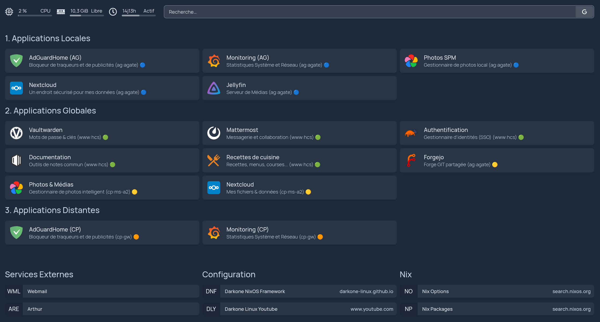
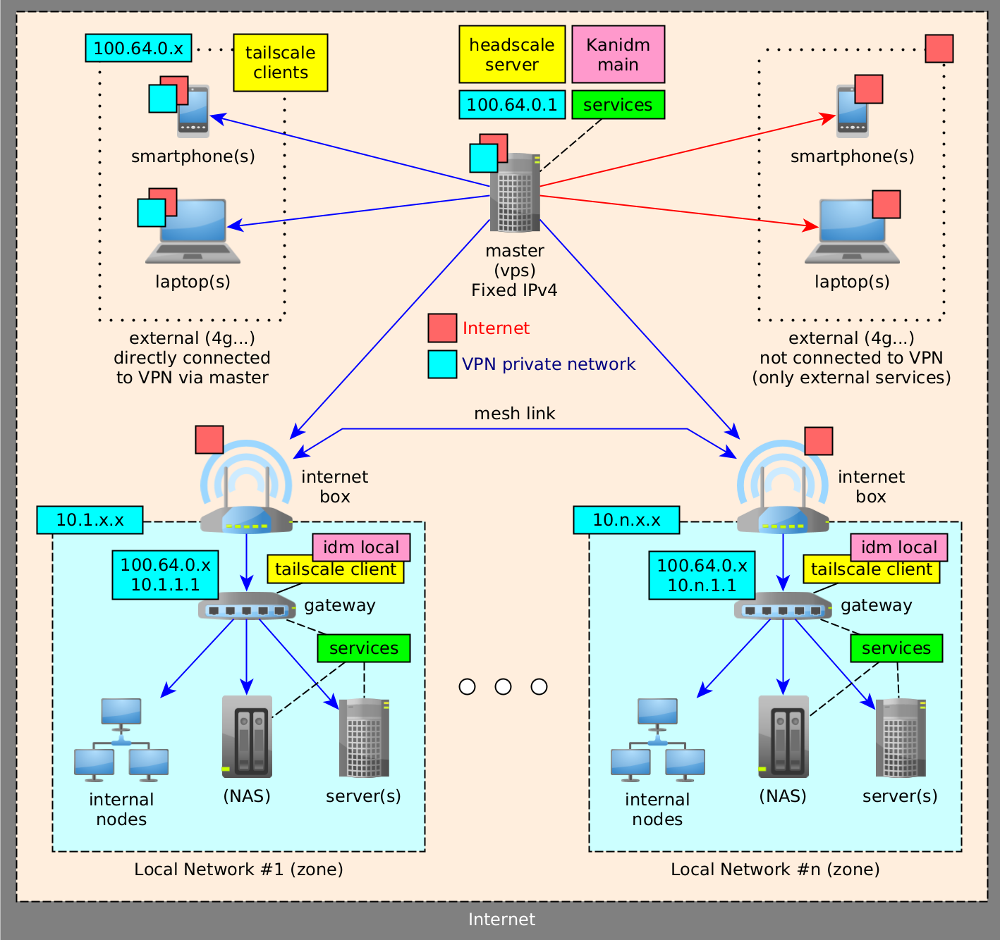
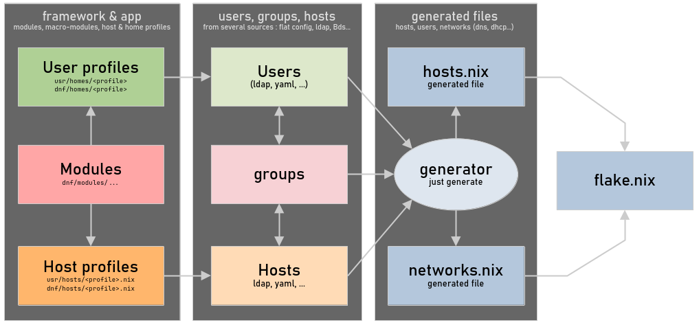

# Darkone NixOS Framework

> [!NOTE]
> La [documentation technique](https://darkone-linux.github.io) en ligne.


## Présentation aux utilisateurs (non technique)

### De quoi s'agit-il ?

Un cloud auto-hébergé composé d'un réseau, de services, d'ordinateurs :

- Un grand "réseau local" (VPN), rapide et protégé des publicités et des malwares.
- Des services pour gérer ses données : documents personnels, images, médias.
- Des systèmes Linux (optionnels) pré-installés et très faciles pour non-informaticiens.

### Quels avantages ?

- 🔐 Sécurité maximale (chiffrement) et 100 % souveraine : nos données restent à nous.
- 🚫 Elles ne peuvent être revendues aux assurances, publicitaires et moteurs d’IA.
- 🔁 Sauvegardes 3-2-1 automatisées, chiffrées et distribuées.
- 🕐 Outils, programmes et services utiles, simples, qui font gagner du temps.
- 👶 Profils et services 100 % sécurisés pour les enfants.
- 🔑 Un seul mot de passe pour tous les services, y compris externes (SSO + coffre-fort).

### Principaux services

Pour tous ces services, une seule connexion suffit ! (pas besoin de rentrer 36 fois 36 mots de passe)

| | Nom | Utilité |
| ----- | ---------------------------------------------------------------- | --------------------------------------------------------------------------------------------------------------------------------------------------------------------------------------------------- |
| 🔐 | [Vaultwarden](https://vaultwarden.net) | Mon coffre-fort à mots de passe, clés et données critiques. Avec les plugins Bitwarden (navigateur, smartphones), je génère et utilise des mots de passe forts pour tous mes comptes. |
| ☁️ | [Nextcloud](https://nextcloud.com) | Mon cloud personnel dans lequel je peux déposer tous mes fichiers et données, les partager comme je veux, les synchroniser avec mes ordinateurs et smartphones. |
| 🖼️ | [Immich](https://immich.app) | Mes photos et vidéos personnelles, une interface fluide et conviviale avec reconnaissance faciale et recherche IA totalement auto-hébergée. |
| 💬 | [Matrix](https://matrix.org) | Application type « WhatsApp » de messagerie et visio, que les enfants peuvent utiliser en toute sécurité (réseau Matrix non fédéré), avec possibilité d’agréger WhatsApp, Telegram, Messenger, etc. |
| 🎬 | [Jellyfin](https://jellyfin.org) | Une médiathèque à la « Netflix » pour les films et la musique, avec une interface très conviviale. |
| 🧑‍💻 | [Forgejo](https://forgejo.org) | Au service de ceux qui utilisent Git pour leurs sources et données (versionnage de documents). |
| 🛑 | [AdGuardHome](https://adguard.com/en/adguard-home/overview.html) | Un filtre anti-publicité et anti-malware qui accélère sensiblement la navigation sur Internet et renforce la sécurité. |
| 🍽️ | [Mealie](https://github.com/hay-kot/mealie) | Application de recettes de cuisine très bien conçue et agréable à utiliser. |
| 📝 | [Outline](https://www.getoutline.com) | Pour prendre des notes individuelles ou collectives. (Outline est une application de prise de notes/wiki auto-hébergeable; site officiel fourni). |


> [!NOTE]
> Les ordinateurs du réseau (sous Linux NixOS) sont 100% pré-installés avec tous les programmes, comptes et configurations.

### Profils d'utilisateurs

Chaque utilisateur est lié à un “profil” (au choix et interchangeable), qui détermine : 

* Les programmes installés (éducation, bureautique, jeux…).
* Les configurations (accès internet, services de communication…).

| **Profil** | **Description** |
|----|----|
| ⚪&nbsp;minimal | Compte épuré avec le strict minimum de programmes. |
| 🔵&nbsp;normal | Pour utilisateur bureautique non-informaticien, avec l'essentiel des programmes. |
| 🟣&nbsp;avancé | Pour utilisateur informaticien, avec des outils avancés. |
| 🔴&nbsp;admin | Compte avancé pour administrer le réseau et les systèmes (expert Linux et Nix requis). |
| 🎨&nbsp;créateur | Pour créateur multimédia, avec tout ce qu'il faut pour créer vidéo, musique, photo / image. |
| 📘&nbsp;étudiant | Des outils utiles d'organisation, prise de notes, entraînement pour les étudiants. |
| 🎮&nbsp;Joueur | Un système épuré avec essentiellement des jeux (utilisé pour les LANs). |
| 🎒&nbsp;ado | Des programmes éducatifs et funs, jeux et services pour commencer avec internet. |
| 🧩&nbsp;enfant | Logiciels éducatifs pour apprendre, jeux pour entraîner son cerveau, pas d'accès internet. |
| 🧸&nbsp;baby | Logiciels limités pour apprendre à utiliser la souris, jouer avec les nombres, formes, etc. |

### Types d'ordinateurs

Notre réseau local est une bulle sécurisée composé de "noeuds" (ordinateurs) qui peuvent être :

| Type | Utilité |
| ---------------------------- | ------------------------------------------------------------------------------------------------------ |
| 📱 Mon smartphone, tablette | Je peux me brancher au réseau et à tous ses services avec mes périphériques portables. |
| 💻&nbsp;Mon&nbsp;ordi&nbsp;et&nbsp;système&nbsp;adoré | Sous Windows, macOS ou Linux, peu importe, je peux aussi me brancher simplement au réseau. |
| ❄️ Ordi au top sous NixOS ! | Tout est installé, configuré, sécurisé. J'ai juste à me connecter et à travailler, jouer, me divertir. |
| 🗄️ Serveur | Un ordinateur qui reste allumé pour y héberger des services (Jellyfin, Immich, sauvegarde, etc.). |
| 🌐 Passerelle | Un petit bijou spécial qui fait le lien entre notre réseau local et Internet (pare-feu, routeur, VPN). |
| 🎼 Serveur de coordination | Ce sombre individu est le « chef d’orchestre » de notre réseau local sur Internet (VPS). |

## Présentation technique

## Une configuration multi-utilisateur, multi-hôte et multi-service

- 🔥 [Déclaratif, reproductible, immuable](https://nixos.org/).
- 🚀 [Modules](https://darkone-linux.github.io/ref/modules/) prêts à l’emploi.
- ❄️ [Configuration](https://github.com/darkone-linux/darkone-nixos-framework/blob/main/usr/config.yaml) simple.
- 🧩 [Organisation](https://darkone-linux.github.io/doc/introduction/#structure) cohérente.
- 🌎 Un [réseau complet](#one-configuration-a-full-network).

Ce projet évolue en fonction de mes besoins. Si vous souhaitez être informé des prochaines versions stables, merci de me le faire savoir sur [GitHub](https://github.com/darkone-linux/darkone-nixos-framework) ou en vous abonnant à ma [chaîne YouTube](https://www.youtube.com/@DarkoneLinux) (FR). Merci !

## Fonctionnalités principales

| | Fonctionnalité | Description |
|---|---------------|-------------|
| ⚙️ | Tout-automatisé | Installation et mise à jour auto des hôtes avec [nixos-anywhere](https://github.com/nix-community/nixos-anywhere), [disko](https://github.com/nix-community/disko) et [colmena](https://github.com/zhaofengli/colmena) |
| 👤 | Profils utilisateurs | [Profils](https://github.com/darkone-linux/darkone-nixos-framework/tree/main/dnf/home/profiles) et [modules](https://darkone-linux.github.io/ref/modules/#home-manager-modules) utilisateurs avec [Home Manager](https://github.com/nix-community/home-manager) (admin, gamer, débutant…) |
| 🖥️ | Profils d’hôtes | [Profils d’hôtes](https://darkone-linux.github.io/ref/modules/#-darkonehostdesktop) (serveurs, conteneurs, nœuds réseau, postes de travail…) |
| 🌐 | VPN Tailnet | [VPN maillé](https://fr.wikipedia.org/wiki/R%C3%A9seau_maill%C3%A9) avec [headscale](https://headscale.net/) + [tailscale](https://tailscale.com/) et [sous-réseaux indépendants](#une-configuration-pour-un-réseau-complet) |
| 🛡️ | Stop Publicités | Internet sécurisé et sans publicité avec [AdguardHome](https://adguard.com/fr/adguard-home/overview.html) et un pare-feu efficace |
| 🧩 | Authentification unique | SSO avec [Kanidm](https://kanidm.com/) : une seule identité pour (presque) tous les services |
| 🤗 | Services intelligents | [Immich](https://immich.app/), [Nextcloud](https://nextcloud.com/), [Forgejo](https://forgejo.org/), [Vaultwarden](https://github.com/dani-garcia/vaultwarden), [Mattermost](https://mattermost.com/), [Jellyfin](https://jellyfin.org/), [etc.](https://darkone-linux.github.io/ref/modules/#-darkoneserviceadguardhome) |
| 💻 | GNOME épuré | Hôtes NixOS avec un [GNOME](https://www.gnome.org/) allégée et des applications stables et utiles |
| 💾 | Sauvegardes 3-2-1 | Sauvegardes robustes, simplifiées et distribuées avec [Restic](https://restic.net/) |
| 🏠 | Page d’accueil | [Page d’accueil automatisée](#page-daccueil-dynamique) → accès rapide à tous les services configurés |

## Sous le capot

| | Spécificité | Description |
|---|---------------|-------------|
| ❄️ | Déclaratif et immuable | Configuration reproductible basée sur [Nix / NixOS](https://nixos.org/) et son écosystème |
| 🔑 | Sécurité renforcée | Stratégie de sécurité simple et fiable, reposant sur [sops-nix](https://github.com/Mic92/sops-nix) |
| 📦 | Modules haut niveau | [Modules NixOS haut-niveau](https://darkone-linux.github.io/ref/modules), faciles à activer et à configurer |
| 📐 | Architecture | [Architecture extensible et scalable](https://darkone-linux.github.io/doc/introduction/#structure), cohérente et personnalisable |
| ✴️ | Proxy inverse | Services distribués à travers le réseau via des proxies sous [Caddy](https://github.com/caddyserver/caddy) |
| 🛜 | Réseau automatisé | Plomberie réseau zero-conf (DNS, DHCP, pare-feu…) avec [dnsmasq](https://thekelleys.org.uk/dnsmasq/doc.html) |

### État des services SSO (OIDC / Oauth2)

- Oauth2 = permet une connexion oauth2 / oidc
- Natif = pas besoin de plugin ou autre, on peut paramétrer directement
- PKCE = prend en charge PKCE
- Déclaratif = tous les paramètres peuvent être déclarés dans la configuration
- OK = implémentation fonctionnelle

| Application | Oauth2 | Natif | PKCE | Déclaratif | OK | Commentaires |
| -------------- | ------ | ----- | ---- | ---------- | --- | ----------------------------------- |
| Outline | ✅ | ✅ | ✅ | ✅ | ✅ | Fonctionne parfaitement |
| Mealie | ✅ | ✅ | ✅ | ✅ | ✅ | Fonctionne parfaitement |
| Vaultwarden | ✅ | ✅ | ✅ | ✅ | ✅ | Fonctionne parfaitement |
| Matrix Synapse | ✅ | ✅ | ✅ | ✅ | ✅ | Marche bien (+Element +Coturn) |
| Immich | ✅ | ✅ | ✅ | ⚠️ | ✅ | Configuration manuelle |
| Forgejo | ✅ | ✅ | ✅ | ❌ | ✅ | Configuration manuelle |
| Nextcloud | ✅ | ❌ | ❌ | ❌ | ✅ | Plugin + configuration manuelle |
| Oauth2 Proxy | ✅ | ✅ | ✅ | ✅ | ⚠️ | Gestion multi-service problématique |
| Jellyfin | ✅ | ❌ | ❔ | ❔ | ❔ | En cours |
| AdGuardHome | ❌ | ❌ | ❌ | ❌ | ❔ | Via Oauth2 Proxy |
| ~~Mattermost~~ | ❌ | ❌ | ❌ | ❌ | ❌ | Plus de Oauth2 pour l'édition TEAM |

## Page d'accueil dynamique



## Une configuration pour un réseau complet



## Organisation

A la racine :

- `dnf` -> modules, users, hosts (framework)
- `usr` -> Projet local (en écriture)
- `var` -> Fichiers générés et logs
- `src` -> Fichiers source du générateur
- `doc` -> Documentation du projet

La [structure complète est documentée ici](https://darkone-linux.github.io/doc/introduction/#structure).

> [!NOTE]
> Cette structure peut être clonée pour chaque configuration et les parties communes
> synchronisées dans un dépôt "upstream" commun.

## Le générateur

```shell
# Lancer le générateur
just generate

# Génération + formattages + checks
just clean
```



Son rôle est de générer une configuration statique pure à partir d'une définition de machines (hosts), utilisateurs et groupes en provenance de diverses sources (déclarations statiques, ldap, etc. configurées dans `usr/config.yaml`). La configuration nix générée est intégrée au dépôt afin d'être fixée et utilisée par le flake.

## Exemples

Un poste "administrateur pour ordinateur portable" complet déclaré dans `usr/config.yaml` :

```yaml
hosts:
 static:
 - hostname: "darkone-laptop" # Nom du host
 name: "An admin laptop" # Description du host
 profile: admin-laptop # Profil du host -> fonctionnalités à installer
 users: [ "darkone", "john" ] # Utilisateurs à installer sur le host
 groups: [ "admin" ] # Groupes d'utilisateurs à installer
```

- Il existe des profils de hosts pré-configurés dans `dnf/modules/nix/host`.
- Les utilisateurs liés au host sont déclarés via `users` et/ou `groups`.
- Utilisateurs et groupes peuvent être déclarés dans la configuration ou dans LDAP.

> [!NOTE]
> On peut créer un nouveau poste informatique avec nixos-anywhere + disko.
>
> ```sh
> # Création automatique du poste "darkone-laptop"
> just full-install darkone-laptop nixos 192.168.1.234
>
> # Puis mise à jour du poste au fur et à mesure
> just apply darkone-laptop
> ```

## Commandes d'administration (justfile)

```shell
❯ just
Available recipes:
 [apply]
 apply on what='switch' # Apply configuration using colmena [alias: a]
 apply-local what='switch' # Apply the local host configuration [alias: al]
 apply-verbose on what='switch' # Apply force with verbose options [alias: av]

 [check]
 check # Recursive deadnix on nix files
 check-flake # Check the main flake
 check-statix # Check with statix

 [dev]
 cat host='' # Clean + git Amend + apply-local (or on host) + Test
 clean # format: fix + check + generate + format [alias: c]
 develop # Launch a "nix develop" with zsh (dev env) [alias: d]
 fix # Fix with statix
 format # Recursive nixfmt on all nix files
 generate # Update the nix generated files
 pull # Pull common files from DNF repository
 push # Push common files to DNF repository

 [install]
 build-iso arch="x86_64-linux" # Build DNF iso image
 configure host # New host: ssh cp id, extr. hw, clean, commit, apply
 configure-admin-host # Framework installation on local machine (builder / admin)
 copy-hw host # Extract hardware config from host
 copy-id host # Copy pub key to the node (nix user must exists)
 full-install host user='nix' ip='auto' # New host: full installation (install, configure, apply)
 install host user='nix' ip='auto' do='install' # New host: format with nixos-everywhere + disko
 install-key host # New host: format with nixos-everywhere + disko
 passwd user # Update a user password
 passwd-default # Update the default DNF password
 push-key host # Push the infrastructure key to the host

 [manage]
 enter on # Interactive shell to the host [alias: e]
 fix-boot on # Multi-reinstall bootloader (using colmena)
 fix-zsh on # Remove zshrc bkp to avoid error when replacing zshrc
 gc on # Multi garbage collector (using colmena)
 halt on # Multi-alt (using colmena)
 reboot on # Multi-reboot (using colmena)
```

## A faire

### En cours

- [ ] SSO avec [Kanidm](https://kanidm.com/) ([module nix](https://search.nixos.org/options?channel=unstable&query=services.idm))
- [ ] SSO -> configuration plus cohérente + gestion des droits.
- [ ] Ponts Mautrix pour Matrix (whatsapp, telegram, messenger, discord).

### Planifié

- [ ] Services -> réorganiser la manière dont on les déclare -> services uniques + avec sous-domaine fixe, sous-domaines interdits déclarables, services multiples avec OIDC.
- [ ] Kanidm -> réplicats de zone.
- [ ] Séparer en 2 projets : flake DNF comme dépendance d'un flake utilisateur.
- [ ] Commandes d'introspection pour lister les hosts, users, modules activés par host, etc.
- [ ] Automatisation des secrets OIDC et similaires.
- [ ] IA générative self-hosted + agents, [AnythingLLM](https://github.com/Mintplex-Labs/anything-llm), [OpenClaw](https://openclaw.ai/) ou autre.
  - [ ] Requêtes générales, générations d'images, etc. locales.
  - [ ] Requêtage des données locales, cloisonné à chaque utilisateur.
  - [ ] Agents MCP personnels.

### Axes d'amélioration

- [ ] Remplacer le générateur PHP par un générateur Rust + parseur nix complet.
- [ ] Tests unitaires + tests de recette.
- [ ] Faire travailler claude code...
- [ ] Remplacer Nextcloud par un équivalent plus simple, stable, performant et OIDC natif
  - [ ] [Ocis](https://doc.owncloud.com/ocis/next/), [OpenCloud](https://opencloud.eu/en/features) ([nix](https://search.nixos.org/options?channel=unstable&query=services.opencloud)), [Filebrowser Quantum](https://filebrowserquantum.com/en/) ([oidc](https://filebrowserquantum.com/en/docs/configuration/authentication/oidc/)), [OxiCloud](https://github.com/DioCrafts/OxiCloud) (un peu jeune)
  - [ ] [Rustical](https://github.com/lennart-k/rustical) ([pr nix](https://github.com/NixOS/nixpkgs/pull/424188), [oidc natif](https://lennart-k.github.io/rustical/setup/oidc/)) ou [Radical](https://github.com/Kozea/Radicale) ([nix](https://search.nixos.org/options?channel=unstable&query=services.radical)) pour calendar / contacts si nécessaire.
- [ ] Remplacer fail2ban par [CrowdSec](https://github.com/crowdsecurity/crowdsec) ([nix](https://search.nixos.org/options?channel=unstable&query=services.crowdsec)) ?

### A voir

- [ ] Intégration de [nixvim](https://nix-community.github.io/nixvim/).
- [ ] Gestion du secure boot avec [lanzaboote](https://github.com/nix-community/lanzaboote).
- [ ] Serveur de mails.
- [ ] Interface [headplane](https://github.com/tale/headplane) pour headscale.

### Fait

- [x] ~~Supprimer~~ Réorganiser les fichiers NixOS dans les espaces home manager.
- [x] Réseaux sociaux : ~~mattermost~~, [matrix](https://nixos.wiki/wiki/Matrix).
- [x] Partages Samba pour windows + linux (par machine).
- [x] [Nextcloud](https://wiki.nixos.org/wiki/Nextcloud) + configuration multi-postes.
- [x] Stratégie de sauvegarde avec [Restic](https://restic.net).
- [x] Création de noeuds avec [nixos-anywhere](https://github.com/nix-community/nixos-anywhere) + [disko](https://github.com/nix-community/disko).
- [x] Services distribués (aujourd'hui les services réseau sont sur la passerelle).
- [x] Réseau distribué avec [Headscale](https://github.com/juanfont/headscale) + [WireGuard](https://www.wireguard.com/)
- [x] Serveurs et postes "externes" (administrable mais ne faisant pas partie du LAN).
- [x] Configuration pour réseau extérieur (https, dns, vpn...).
- [x] Let's encrypt
- [x] Architecture modulaire.
- [x] Configuration colmena.
- [x] Configuration transversale générale.
- [x] Déploiements avec Just (build regular + apply colmena).
- [x] Générateur de configuration nix statique.
- [x] Modules système de base (hardware, i18n, doc, network, performances).
- [x] Modules console de base (zsh, git, shell).
- [x] Modules graphic de base (gnome, jeux de paquetages).
- [x] Hosts préconfigurés : minimal, serveur, desktop, laptop.
- [x] [Justfile](https://github.com/casey/just) pour checker et fixer les sources.
- [x] Postes types (bureautique, développeur, administrateur, enfant).
- [x] Builder d'[ISOs d'installation](https://github.com/nix-community/nixos-generators) pour les machines à intégrer.
- [x] Multi-réseaux.
- [x] Fixer les UIDs (des users).
- [x] Normaliser les données générées en séparant hosts et users.
- [x] Configuration multi-architecture (x86_64 & aarch64).
- [x] Passerelle type (dhcp, dns, ap, firewall, adguard, AD, VPN).
- [x] Documentation FR et EN.
- [x] [Nix Cache Proxy Server](https://github.com/kalbasit/ncps).
- [x] Homepage automatique en fonction des services activés.
- [x] Générateur automatique de documentation à partir des sources.
- [x] Sécurisation avec [fail2ban](https://github.com/fail2ban/fail2ban) ([module](https://search.nixos.org/options?channel=unstable&from=0&size=50&sort=relevance&type=packages&query=services.fail2ban)).
- [x] Gestion des mots de passe avec [sops](https://github.com/Mic92/sops-nix).
- [x] Passerelle : ajouter [adguard home](https://wiki.nixos.org/wiki/Adguard_Home).
- [x] just clean: détecter les fails, les afficher et s'arrêter.
- [x] Générer les stateVersion des users.
- [x] FQDN
- [x] Optimisations réseau :
  - [x] Domaines locaux des machines -> 127.0.0.1 (shunt dnsmasq + adguard)
  - [x] Homepage GW -> accès aux services globaux installés sur le réseau hors GW

### Annulé

- [x] ~~Permettre de croiser les profils home manager + supprimer la hiérarchie des profils.~~
