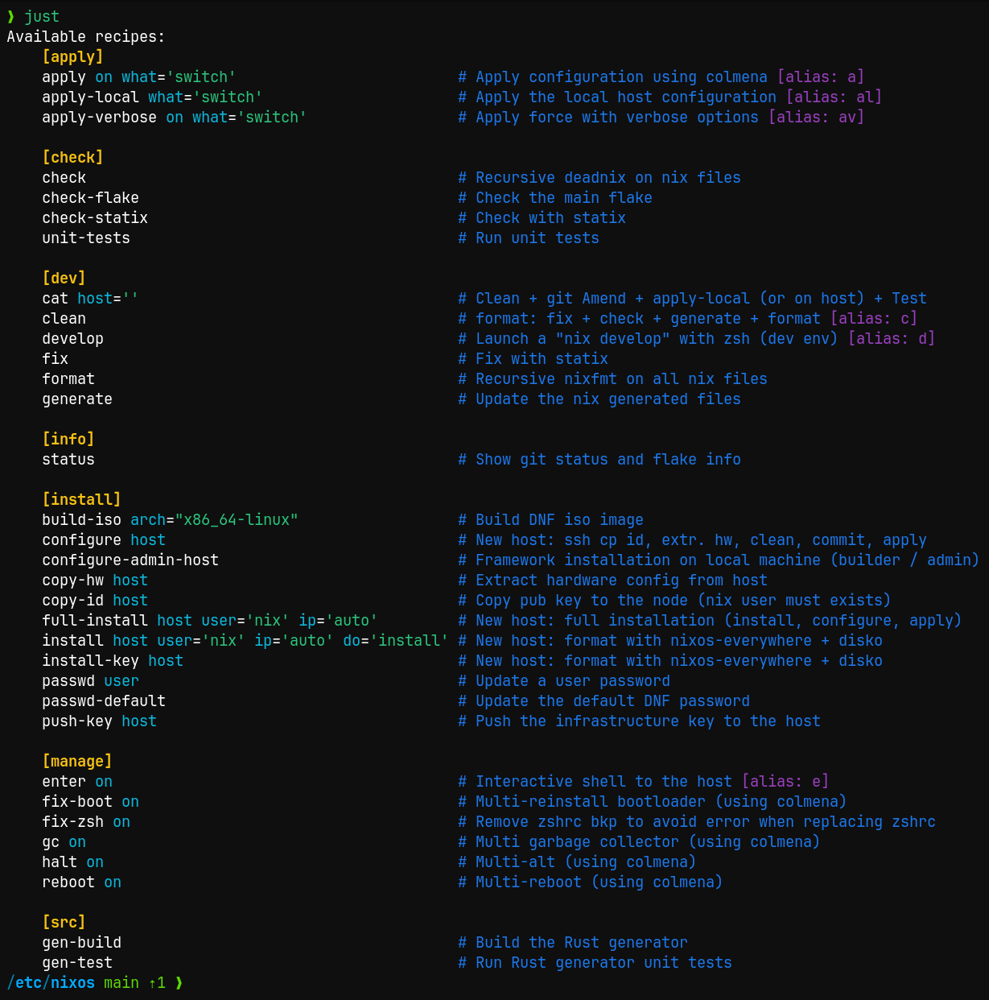
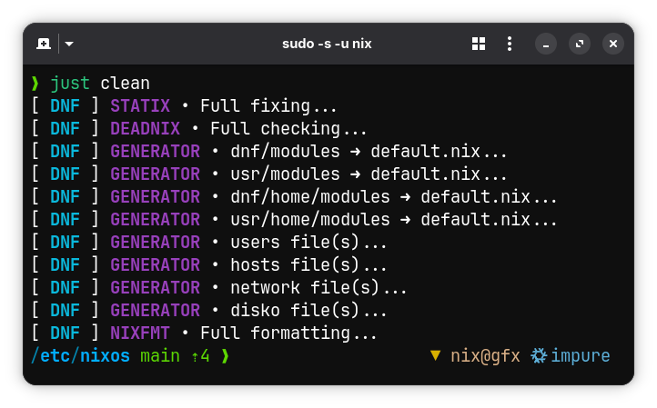
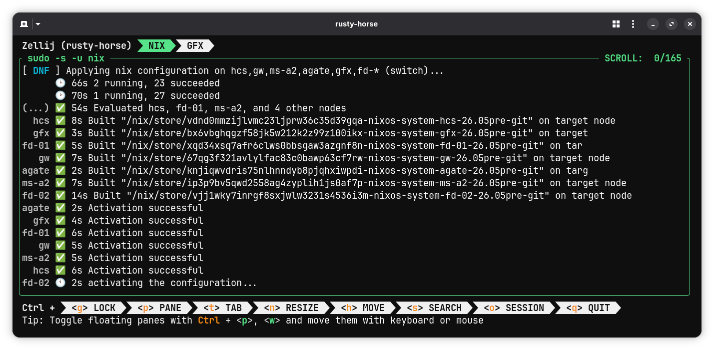

# Darkone NixOS Framework

- [The official documentation](https://darkone-linux.github.io)
- [Ce README en français](README.fr.md)
- [To-Do list (fr)](README.fr.md#a-faire)

## A multi-user, multi-services & multi-host configuration

- 🔥 [Declarative, reproducible, immutable](https://nixos.org/).
- 🚀 Ready-to-use [modules](https://darkone-linux.github.io/en/ref/modules/).
- ❄️ Simple [main configuration](https://github.com/darkone-linux/darkone-nixos-framework/blob/main/usr/config.yaml).
- 🧩 Consistent [structure](https://darkone-linux.github.io/en/doc/introduction/#structure).
- 🌎 A [full network](#one-configuration-for-a-full-network).

This project is constantly evolving according to my needs. If you'd like to be informed about upcoming stable versions, please let me know on [GitHub](https://github.com/darkone-linux/darkone-nixos-framework) or by subscribing to my [YouTube channel](https://www.youtube.com/@DarkoneLinux) (FR). Thank you!

## Main features

|   | Feature | Description |
|---|--------|-------------|
| ⚙️ | Automated install | Fully automated host install / update with [nixos-anywhere](https://github.com/nix-community/nixos-anywhere), [disko](https://github.com/nix-community/disko) & [colmena](https://github.com/zhaofengli/colmena) |
| 👤 | User profiles | User [profiles](https://github.com/darkone-linux/darkone-nixos-framework/tree/main/dnf/home/profiles) and [modules](https://darkone-linux.github.io/ref/modules/#home-manager-modules) with [Home Manager](https://github.com/nix-community/home-manager) (admin, gamer, beginner...) |
| 🖥️ | Host profiles | [Host profiles](https://darkone-linux.github.io/ref/modules/#-darkonehostdesktop) (servers, containers, network nodes, workstations...) |
| 🌐 | Tailnet VPN | [Full-mesh VPN](https://en.wikipedia.org/wiki/Mesh_networking) with [headscale](https://headscale.net/) + [tailscale](https://tailscale.com/), [independent subnets](#one-configuration-for-a-full-network) |
| 🛡️ | Ad-Free web | Secure, ad-free internet with [AdguardHome](https://adguard.com/fr/adguard-home/overview.html) and effective firewall |
| 🧩 | Single Sign On | SSO strategy with [Kanidm](https://kanidm.com/): one identity for (almost) all services |
| 🤗 | Smart services | [Immich](https://immich.app/), [Nextcloud](https://nextcloud.com/), [Forgejo](https://forgejo.org/), [Vaultwarden](https://github.com/dani-garcia/vaultwarden), [Mattermost](https://mattermost.com/), [Jellyfin](https://jellyfin.org/), [etc.](https://darkone-linux.github.io/ref/modules/#-darkoneserviceadguardhome) |
| 💻 | Clean Gnome | NixOS hosts with streamlined [GNOME UI](https://www.gnome.org/) + stable and useful apps |
| 💾 | 3-2-1 Backups | Robust, simplified, and widespread backups with [Restic](https://restic.net/) |
| 🤖 | Generative AI | Secure, on-premises generative AI, using [Open WebUI](https://openwebui.com/) and [Ollama](https://ollama.com/) |
| 🏠 | Homepage | [Automated homepage](#homepage-screenshot) -> quick access to all configured services |

## Under the hood

|   | Specificity | Description |
|---|--------|-------------|
| ❄️ | Declarative & Immutable | Fully reproducible configuration based on [Nix / NixOS](https://nixos.org/) and its ecosystem |
| 🔑 | Enhanced security | Simple and reliable security strategy powered by [sops-nix](https://github.com/Mic92/sops-nix) |
| 📦 | High-level modules | [High-level NixOS modules](https://darkone-linux.github.io/ref/modules), easy to enable and configure |
| 📐 | Consistent architecture | [Extensible and scalable architecture](https://darkone-linux.github.io/doc/introduction/#structure), consistent and customizable |
| ✴️ | Reverse proxy | Services distributed across network servers through [Caddy](https://github.com/caddyserver/caddy) proxies |
| 🛜 | Auto-networking | Zero-conf network plumbing (DNS, DHCP, firewall...) with [dnsmasq](https://thekelleys.org.uk/dnsmasq/doc.html)  |

## SSO status

*   **OAuth2** = supports OAuth2 / OIDC
*   **Native** = no plugin or external component required; can be configured directly
*   **PKCE** = supports PKCE
*   **Declarative** = all settings can be declared in NixOS
*   **OK** = works on my configuration

| Application | OAuth2 | Native | PKCE | Declarative | OK | Comments |
| --- | --- | --- | --- | --- | --- | --- |
| Outline | ✅ | ✅ | ✅ | ✅ | ✅ | Works perfectly |
| Mealie | ✅ | ✅ | ✅ | ✅ | ✅ | Works perfectly |
| Vaultwarden | ✅ | ✅ | ✅ | ✅ | ✅ | Fill the right e-mail first |
| Matrix Synapse | ✅ |  ✅ |  ✅ |  ✅ |  ✅ | Works Fine (+Element +Coturn) |
| Open WebUI | ✅ |  ✅ |  ✅ |  ✅ |  ✅ | Works Fine (+Ollama) |
| Immich | ✅ | ✅ | ✅ | ⚠️ | ✅ | Non-declarative configuration |
| Forgejo | ✅ | ✅ | ✅ | ❌ | ✅ | Non-declarative configuration |
| Nextcloud | ✅ | ❌ | ❌ | ❌ | ✅ | Requires a plugin, non-declarative |
| OAuth2 Proxy | ✅ | ✅ | ✅ | ✅ | ⚠️ | Multiple backends to resolve |
| Jellyfin | ✅ | ❌ | ❔ | ❔ | ❔ | Coming soon |
| Grafana | ✅ | ❔ | ❔ | ❔ | ❔ | Coming soon |
| AdGuard Home | ❌ | ❌ | ❌ | ❌ | ❔ | Via OAuth2 Proxy |
| ~~Mattermost~~ | ❌ | ❌ | ❌ | ❌ | ❌ | No more OAuth2 for the TEAM edition |

## Homepage screenshot

## One configuration for a full network

## Easy admin with Just

## Easy Nix code clean, generation and fix

## Easy multi-host deployment

