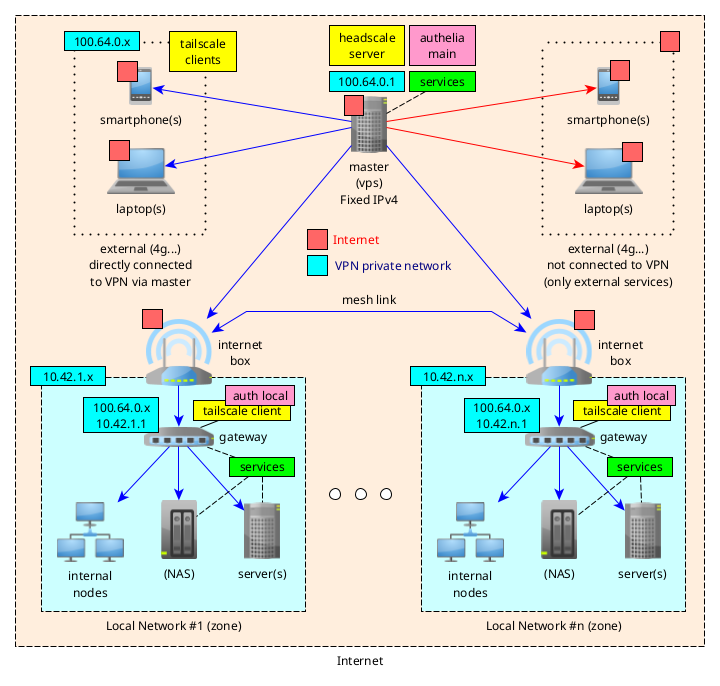

# Darkone NixOS Framework

- [The official documentation](https://darkone-linux.github.io)
- [The french readme with a todo list](README.fr.md)

## A multi-user, multi-host, ready-to-use NixOS configuration

- 🚀 Ready-to-use [modules, profiles and tools](https://darkone-linux.github.io/ref/modules/).
- ❄️ Simple [high-level configuration](https://github.com/darkone-linux/darkone-nixos-framework/blob/main/usr/config.yaml).
- 🧩 Modular [structure](https://darkone-linux.github.io/doc/introduction/#structure).
- 🌎 One config for a [full network](#one-configuration-a-full-network).

This project is constantly evolving according to my needs.
If you'd like to be informed about upcoming stable versions, 
please let me know on [GitHub](https://github.com/darkone-linux/darkone-nixos-framework) 
or by subscribing to my [YouTube channel](https://www.youtube.com/@DarkoneLinux) (FR).
Thank you!

## Main features

|   | Feature | Description |
|---|--------|-------------|
| ⚙️ | Automated install | Fully automated host install/update with [nixos-anywhere](https://github.com/nix-community/nixos-anywhere), [disko](https://github.com/nix-community/disko), [colmena](https://github.com/zhaofengli/colmena) |
| 👤 | User profiles | User [profiles](https://github.com/darkone-linux/darkone-nixos-framework/tree/main/dnf/home/profiles) and [modules](https://darkone-linux.github.io/ref/modules/#home-manager-modules) with [Home Manager](https://github.com/nix-community/home-manager) (admin, gamer, beginner...) |
| 🖥️ | Host profiles | [Host profiles](https://darkone-linux.github.io/ref/modules/#-darkonehostdesktop) (servers, containers, network nodes, workstations...) |
| 🌐 | Tailnet VPN | Simple full-mesh VPN powered by [headscale](https://headscale.net/) / [tailscale](https://tailscale.com/) |
| 🔑 | Security | Simple and reliable security strategy powered by [sops-nix](https://github.com/Mic92/sops-nix) |
| 🧩 | Single Sign On | Full SSO strategy with [Kanidm](https://kanidm.com/) (one account for all services) |
| 🤗 | Smart applications | [Immich](https://immich.app/), [Nextcloud](https://nextcloud.com/), [Forgejo](https://forgejo.org/), [Vaultwarden](https://github.com/dani-garcia/vaultwarden), [Mattermost](https://mattermost.com/), [Jellyfin](https://jellyfin.org/), [etc.](https://darkone-linux.github.io/ref/modules/#-darkoneserviceadguardhome) |
| 📦 | High-level modules | [High-level NixOS modules](https://darkone-linux.github.io/ref/modules), enabled with a simple `.enable = true` |
| 💾 | 3-2-1 Backups | Comprehensive backup strategy with [Restic](https://restic.net/) |
| 📐 | Architecture | [Extensible and scalable architecture](https://darkone-linux.github.io/doc/introduction/#structure), consistent and customizable |
| 🏠 | Home & proxy | [Automated homepage and reverse proxy](https://darkone-linux.github.io/ref/modules/#-darkoneservicehomepage) with [Homepage](https://github.com/gethomepage/homepage) and [Caddy](https://github.com/caddyserver/caddy) |
| 🛜 | Networking | Zero-conf network plumbing (DNS, DHCP, firewall...) with [dnsmasq](https://thekelleys.org.uk/dnsmasq/doc.html)  |
| 🛡️ | Ad-Free web | Secure, ad-free internet with [AdguardHome](https://adguard.com/fr/adguard-home/overview.html) |
| 💻 | Easy GNOME | Streamlined, easy-to-use [GNOME interface](https://www.gnome.org/) for beginners and experts alike |

## SSO status

*   **OAuth2** = supports OAuth2 / OIDC
*   **Native** = no plugin or external component required; can be configured directly
*   **PKCE** = supports PKCE
*   **Declarative** = all settings can be declared in NixOS
*   **OK** = works on my configuration

| Application | OAuth2 | Native | PKCE | Declarative | OK | Comments |
| --- | --- | --- | --- | --- | --- | --- |
| Outline | ✅ | ✅ | ✅ | ✅ | ✅ | Works perfectly |
| Mealie | ✅ | ✅ | ✅ | ✅ | ✅ | Works perfectly |
| Immich | ✅ | ✅ | ✅ | ⚠️ | ✅ | Non-declarative configuration |
| Forgejo | ✅ | ✅ | ✅ | ❌ | ✅ | Non-declarative configuration |
| Nextcloud | ✅ | ❌ | ❌ | ❌ | ✅ | Requires a plugin, non-declarative |
| OAuth2 Proxy | ✅ | ✅ | ✅ | ✅ | ⚠️ | Multiple backends to resolve |
| Jellyfin | ✅ | ❌ | ❔ | ❔ | ❔ | Coming soon |
| Matrix Synapse | ✅ | ❔ | ❔ | ❔ | ❔ | Coming soon |
| Grafana | ✅ | ❔ | ❔ | ❔ | ❔ | Coming soon |
| AdGuard Home | ❌ | ❌ | ❌ | ❌ | ❔ | Via OAuth2 Proxy |
| Vaultwarden | ⚠️ | ❌ | ❔ | ⚠️ | ❌ | OIDCWarden fork, not in nixpkgs |
| Mattermost | ❌ | ❌ | ❌ | ❌ | ❌ | No more OAuth2 for the TEAM edition |

## Homepage screenshot


## One configuration, a full network



## Just commands

```
Available recipes:
    [apply]
    apply on what='switch'                         # Apply configuration using colmena [alias: a]
    apply-local what='switch'                      # Apply the local host configuration [alias: al]
    apply-verbose on what='switch'                 # Apply force with verbose options [alias: av]

    [check]
    check                                          # Recursive deadnix on nix files
    check-flake                                    # Check the main flake
    check-statix                                   # Check with statix

    [dev]
    cat host=''                                    # Clean + git Amend + apply-local (or on host) + Test
    clean                                          # format: fix + check + generate + format [alias: c]
    develop                                        # Launch a "nix develop" with zsh (dev env) [alias: d]
    fix                                            # Fix with statix
    format                                         # Recursive nixfmt on all nix files
    generate                                       # Update the nix generated files
    pull                                           # Pull common files from DNF repository
    push                                           # Push common files to DNF repository

    [install]
    build-iso arch="x86_64-linux"                  # Build DNF iso image
    configure host                                 # New host: ssh cp id, extr. hw, clean, commit, apply
    configure-admin-host                           # Framework installation on local machine (builder / admin)
    copy-hw host                                   # Extract hardware config from host
    copy-id host                                   # Copy pub key to the node (nix user must exists)
    full-install host user='nix' ip='auto'         # New host: full installation (install, configure, apply)
    install host user='nix' ip='auto' do='install' # New host: format with nixos-everywhere + disko
    install-key host                               # New host: format with nixos-everywhere + disko
    passwd user                                    # Update a user password
    passwd-default                                 # Update the default DNF password
    push-key host                                  # Push the infrastructure key to the host

    [manage]
    enter on                                       # Interactive shell to the host [alias: e]
    fix-boot on                                    # Multi-reinstall bootloader (using colmena)
    fix-zsh on                                     # Remove zshrc bkp to avoid error when replacing zshrc
    gc on                                          # Multi garbage collector (using colmena)
    halt on                                        # Multi-alt (using colmena)
    reboot on                                      # Multi-reboot (using colmena)
```
