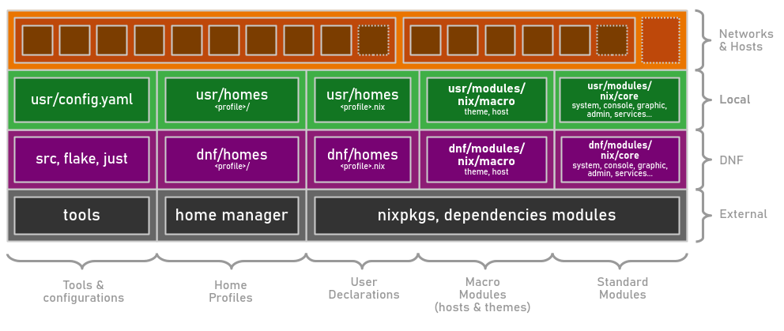

import { FileTree } from '@astrojs/starlight/components';

:::tip[This project is under development]
If you'd like to be informed about upcoming stable versions, please let me know on [GitHub](https://github.com/darkone-linux/darkone-nixos-framework) or by subscribing to my [YouTube channel](https://www.youtube.com/@DarkoneLinux) (FR). Thank you!
:::

:::note[Multi-user, multi-host, ready-to-use NixOS configuration with:]
- A simplified high-level configuration.
- A consistent and modular structure.
- Ready-to-use modules, profiles and tools.
- An organization designed for scalability.
:::

## Features

- **[Multi-hosts and multi-users](/doc/specifications/#the-generator)**, deployed with [colmena](https://github.com/zhaofengli/colmena) and [just](https://github.com/casey/just).
- **[Host profiles](/ref/host-profiles/)** for servers, containers, and workstations.
- **[User profiles](/ref/user-profiles/)** providing common configurations for various users.
- **[High-level modules](/ref/modules/)** 100% functional with a simple `.enable = true`.
- **[Extensible](#files-organisation)**, scalable, consistent, customizable architecture.
- **[User profiles management](/ref/user-profiles/)** with [home manager](https://github.com/nix-community/home-manager) + [home profiles](/ref/user-profiles/#home-profiles).
- **Automatic homepage** with [Homepage](https://github.com/gethomepage/homepage), based on activated services.
- **[Cross-configuration](/doc/specifications/#the-configuration-file)** to ensure network consistency.
- **Easy and reliable security**, a single password to unlock, with [sops](https://github.com/Mic92/sops-nix).

## Files organisation

Main folders:

- `dnf` -> **Framework**: tools + modules + profiles (users, hosts, themes)
- `usr` -> **Local project**: config, modules + profiles, machines, users
- `src` -> Generator and scripts for tools
- `var` -> Generated files and logs
- `doc` -> Framework documentation

### Layers

The lower layers serve the upper layers.

The configurations are also organized by category:

- **[Standard modules](/ref/modules/#standard-modules)**: Ready-to-use simple modules (just write `.enable = true`).
- **[Macro-modules](/ref/modules/#macro-modules)**: Ready-to-use collections of modules with additional configurations.
- **[Users' declaration](/doc/specifications/#users-declaration-example)**: Used to instantiate real users from [user profiles](/ref/user-profiles/).
- **[Home profiles](/doc/specifications/#create-a-user-profile-example)**: Contain core [Home Manager](https://github.com/nix-community/home-manager) configurations for each user profile.
- **[Tools & configurations](/doc/user-manual/#just-commands)**: Manage the generation and quality of Nix declarations.

### Structure

<FileTree>
- flake.nix Main flake
- Justfile Project management with [just](/doc/user-manual/#just-commands)
- dnf/ Darkone Nixos Framework (modules & common files)
  - modules/ [Framework modules](/ref/modules/)
    - nix Nix modules
      - core Core (regular) nix modules
        - system/ System / Hardware configurations
          - core.nix
          - i18n.nix
          - doc.nix
          - …
        - console/ CLI applications
        - graphic/ X applications
        - service/ Daemons
        - admin/ Nix administration settings
          - nix.nix Nix tools
          - …
        - user/ User management (not home)
          - nix.nix Nix special user (for deployments)
          - build.nix Users builder
          - …
      - macro Macro modules
        - host/ [Host profiles](/ref/host-profiles/)
          - desktop.nix
          - laptop.nix
          - server.nix
          - vm.nix
          - minimal.nix
          - …
        - theme/ [Thematic features](/ref/themes/)
          - office.nix
          - advanced.nix
          - student.nix
          - …
      - default.nix Auto-generated default
    - home Home manager modules
      - zed.nix
      - …
      - default.nix Auto-generated default
  - homes/ [User profiles (.nix) + home profiles (dirs)](/ref/user-profiles/)
    - admin.nix Admin user profile config (extragroups, etc.)
    - admin/ Admin user profile home
    - advanced/ Advanced user with development tools
    - minimal/ Easy environment
    - normal/ Non-technical user
    - gamer/ Optimized environment for gamers
    - child/ Kids softwares and settings
    - …
  - overlays/
- **usr/** Writable zone for local network project
  - config.yaml [Local configuration](/doc/specifications/#the-configuration-file) used by [the generator](/doc/specifications/#the-generator)
  - modules/ Local modules
    - nix/
      - core/
      - macro/
        - host/ [Local host profiles](/doc/specifications/#create-a-host-profile-example)
    - home/
  - secrets/ Local secrets file
  - homes/ [Local home profiles](/doc/specifications/#create-a-user-profile-example)
  - machines/ Machine specific configuration by host (hardwares)
  - overlays/
- var/
  - log/
  - generated/ [Generated files](/doc/specifications/#the-generator)
    - hosts.nix Hosts to deploy
    - users.nix Users to deploy
    - network.nix Local network configuration
- src/ Generator sources
</FileTree>
