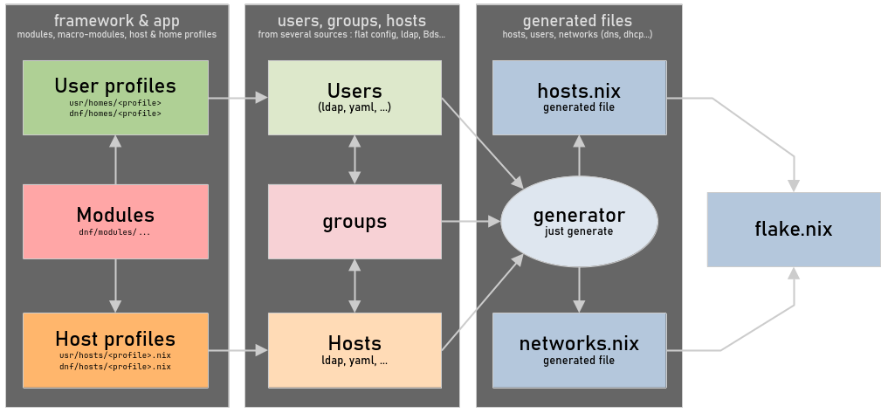

import { Steps } from '@astrojs/starlight/components';

## Goals

This framework enables the quick and easy declaration of one or more computer networks, complete with ready-to-use configurations and profiles:

- **User profiles** range from non-technical users (office tasks, multimedia) to advanced users (developers, administrators).
- **Host profiles** cover standard use cases: workstations, development environments, administrative systems, or network nodes (e.g., gateways).

:::note[Universal settings]
Configurations are designed to be fully functional, clean, consistent, easy to use, and require no extensive customization.
:::

:::tip[Use cases]
For example, this configuration can be used for:

- **Your work**: A network with a gateway, servers, and workstations.
- **Your family**: Gateway and host profiles tailored for parents and kids.
- **Your projects**: Servers and workstations designed to meet your specific needs.
:::

## Implemented features

This section includes everything that is currently implemented and functional.

### The generator

Its role is to generate a pure static configuration from a definition of machines (hosts), users, and groups from various sources (static declarations, LDAP, etc. configured in [`usr/config.yaml`](#the-configuration-file). The generated Nix configuration is integrated into the repository to be fixed and used by the flake.



Usage:

```shell
# Only generate
just generate

# Generate + fix + format + check
just clean
```

A `just clean`:

```shell
❯ just clean
-> Fixing source code with statix...
-> Checking nix files with deadnix...
-> generating dnf/modules default.nix...
-> generating usr/modules default.nix...
-> generating dnf/overlays default.nix...
-> generating users in var/generated/users.nix...
-> generating hosts in var/generated/hosts.nix...
-> generating network in var/generated/network.nix...
-> Formatting nix files with nixfmt...
```

:::note[The generated files]
- `var/generated/hosts.nix` The full host collection
- `var/generated/users.nix` The explicitly created user collection
- `var/generated/network.nix` The network configuration
:::

### The configuration file

The `usr/config.yaml` file contains declarations of users, hosts, network config and providers. [The generator](#the-generator) reads this file to create a static pure nix configuration.

:::note[Users - groups - hosts]
You can link users and hosts either directly or through a group list, which is declared in the users and/or groups items.
:::

#### Users' declaration example

```yaml
# usr/config.yaml
# Static users
# -> profile is the HomeManager profile
# -> groups is used to select related hosts
users:

  # A nix administrator
  nixos:
    uid: 10000
    name: "NixOS User"
    profile: "nix-admin"
    groups: [ "admin" ]

  # A real user (admin)
  darkone:
    uid: 1000
    name: "Darkone Linux"
    email: "darkone@darkone.yt"
    profile: "darkone"
    groups: [ "admin", "media", "common" ]

  # A student with specific profile "student"
  ethan:
    uid: 1101
    name: "Ethan"
    profile: "student"
    groups: [ "sn", "tsn" ]

  # A child of my home network
  esteban:
    uid: 1001
    name: "Esteban"
    profile: "teenager"
    groups: [ "kids", "common" ]
```

#### Hosts' declaration example

```yaml
# usr/config.yaml
# Hosts declaration
# -> name: human readable name or description
# -> profile: the host profile related to this host
# -> users: a list of existing user logins
# -> groups: used to select related users
# -> tags: added to colmena tags for deployment filtering.
# -> local: true is only for the local (master) machine.
hosts:

  # Static hosts
  static:

    # A host for the nix administrator
    - hostname: "nix-adm"
      name: "Nix Administration"
      profile: "nix-admin"
      users: [ "darkone" ]
      groups: [ "admin" ]
      tags: [ "local", "admin" ]
      local: true

    # A gateway server
    - hostname: "sn-network"
      name: "SN Network Gateway"
      profile: "sn-network"
      groups: [ "sn-admin" ]

  # Host groups by range (generated from min to max)
  range:

    # 12 workstations based on the profile "sn-workstation"
    - hostname: "pc%'02s"
      name: "Workstation %d"
      profile: "sn-workstation"
      range: [ 1, 12 ]
      groups: [ "tsn", "sn" ]

  # List of similar hosts (each item is a host)
  list:

    # 3 similar hosts (for the default network)
    - hostname: "laptop-%s" # optional
      name: "Laptop %s" # optional
      profile: "home-laptop"
      hosts:
          kids1: "Kids Laptop 1"
          kids2: "Kids Laptop 2"
          family: "Family Laptop"
      groups: [ "common" ]
```

### Network declaration example

:::caution
This example is incomplete, and this part is subject to future changes.
:::

```yaml
# usr/config.yaml
# Global network configuration is converted in lists / attSets to be used in
# your nix configuration through "network" special arg.
network:
  domain: "darkone.lan"
  gateway:
    hostname: "gateway"
    interfaces:
      wan:
        interface: "eth0"
        gateway: "192.168.0.1"
      lan:
        interface: "enu1u4"
```

### Create a host profile (example)

<Steps>

1. Configuring a module for a ready-to-use workstation template

    ```nix
    # usr/modules/host/sn-workstation.nix
    { lib, config, ... }:
    let
      cfg = config.darkone.host.sn-workstation;
    in
    {
      # A simple .enable declaration for my module
      options = {
        darkone.host.sn-workstation.enable = lib.mkEnableOption "SN workstation host profile";
      };

      # If this module is enabled
      config = lib.mkIf cfg.enable {

        # Activate all the necessary to have an office PC
        darkone.host.desktop.enable = true;

        # Activate the "office" theme with related softwares
        darkone.theme.office.enable = true;

        # Add obsidian to the previous configuration
        darkone.graphic.obsidian.enable = true;
      };
    }
    ```

    :::note
    - There are also pre-configured host profiles in `dnf/modules/host`.
    - Users linked to the host are declared via `users` and/or `groups`.
    - Users and groups can be declared in [the configuration](#the-configuration-file) or in LDAP.
    :::

2. Now, let's create a workstation host

    ```yaml
    # usr/config.yaml
    hosts:
        static:
            - hostname: "my-pc"
              name: "A PC"
              profile: workstation
              users: [ "darkone" "john" ]
    ```

</Steps>

:::tip
To install a new machine, the easiest way is to generate an image:

```sh
# A minimal ISO image
nix build .#start-img-iso

# A minimal VM image
nix build .#start-img-vbox
```

Then, apply the new host:

```sh
# Creation or update
just apply pc01

# With an IP if `pc01` is not in your DNS server
just apply pc01 <ip-address>

# Applying all hosts with the tag "desktop"
just apply @desktop

# Applying all hosts used by the user "darkone"
just apply @user-darkone
```
:::

### Create a user profile (example)

<Steps>

1. User creation in the nix general configuration

    ```nix
    # usr/homes/sn-user.nix
    # A student for the network "sn"
    { pkgs, lib, config, ... }:
    { initialPassword = "sn2025"; }
    // import ./../../dnf/homes/student.nix { inherit pkgs lib config; }
    ```

2. Home manager profile

    ```nix
    # usr/homes/sn-user/default.nix
    { pkgs, ... }:
    {
      imports = [ ./../../../dnf/homes/student ];
      home.packages = with pkgs; [
        hunspell
        hunspellDicts.fr-moderne
        libreoffice-fresh
        obsidian
      ];
      home.stateVersion = "25.05";
    }
    ```

</Steps>

## Work in progress features

:::caution
These examples are not yet fully functional and may differ in the future stable version of the project.
:::

### LLDAP Users provider

:::note
[Light LDAP (lldap)](https://github.com/lldap/lldap) is a lightweight authentication server that provides an opinionated, simplified LDAP interface for authentication. It integrates with many backends, from KeyCloak to Authelia to Nextcloud and [more](https://github.com/lldap/lldap#compatible-services).
:::

```yaml
# usr/config.yaml
hostProvider:
  lldap:

    # Use nsswitch to login users, otherwise user configurations are
    # generated in the nix configuration
    nss: true
    url: "ldap://localhost:3890"
    bind:
      user: "admin"
      passwordFile: "lldap" # located in usr/secrets

```

### A full-featured gateway (example)

Minimal [host profile](../ref/host-profiles/) declaration:

```nix
# usr/modules/host/server-gateway.nix

{ lib, config, ... }:
let
  cfg = config.darkone.host.server-gateway;
in
{
  options = {
    darkone.host.server-gateway.enable = lib.mkEnableOption "My gateway host profile";
  };

  config = lib.mkIf cfg.enable {
    darkone.host.gateway = {
      enable = true;
      wan.interface = "eth0";
      lan.interfaces = [ "eth1" "eth2" ];
    };
  };
}
```

A more complete version:

```nix
# usr/modules/host/server-gateway.nix
{
  # ...
  darkone.host.gateway = {
    enable = true;
    wan = {
      interface = "eth0";
      gateway = "192.168.0.1"; # optional
    };
    lan = {
      interfaces = [ "wlan0" "enu1u4" ]; # wlan must be an AP
      bridgeIp = "192.168.1.1";
      domain = "arthur.lan"; # optional (default is <hostname>.lan)
      dhcp = { # optional
        enable = true;
        range = "192.168.1.100,192.168.1.230,24h";
        hosts = [
          "e8:ff:1e:d0:44:82,192.168.1.2,darkone,infinite"
          "f0:1f:af:13:62:a5,192.168.1.3,laptop,infinite"
        ];
        extraOptions = [
          "option:ntp-server,191.168.1.1"
        ];
      };
      accessPoints = [
        {
          wlan0 = {
            ssid = "Mon AP";
            passphrase = "Un password";
          };
        }
      ];
    };
  };
}
# ...
```

To deploy:

```sh
# Simple and optimal
just apply gateway

# Colmena
colmena apply --on gateway switch
```

## In reflexion

:::danger
Not yet functional at this time.
:::

### K8S installation

Master (minimal working configuration) :

```nix
{
  # Host k8s-master
  darkone.k8s.master = {
    enable = true;
    modules = {
      nextcloud.enable = true;
      forgejo.enable = true;
    };
  };
}
```

Slave (known and authorized because declared in the same DNF configuration):

```nix
{
  # Host k8s-slave-01
  darkone.k8s.slave = {
    enable = true;
    master.hostname = "k8s-master";
  };
}
```

Master with options:

```nix
{
  # Host k8s-master
  darkone.k8s.master = {
    enable = true;
    modules = {
      nextcloud.enable = true;
      forgejo.enable = true;
    };
    preemtibleSlaves = {
      hosts = [ "k8s-node-01" "k8s-node-02" ];
      xen.hypervisors = [
        {
          dom0 = "xenserver-01";
          vmTemplate = "k8s-node";
          minStatic = 3;
          maxPreemptible = 20;
        }
      ];
    };
  };
}
```

### Introspection commands

```shell
# Host list with resume for each
just host

# Host details : settings, activated modules, user list...
just host my-pc

# User list with resume (name, mail, host count)
just user

# User details : content, feature list, host list...
just user darkone
```
