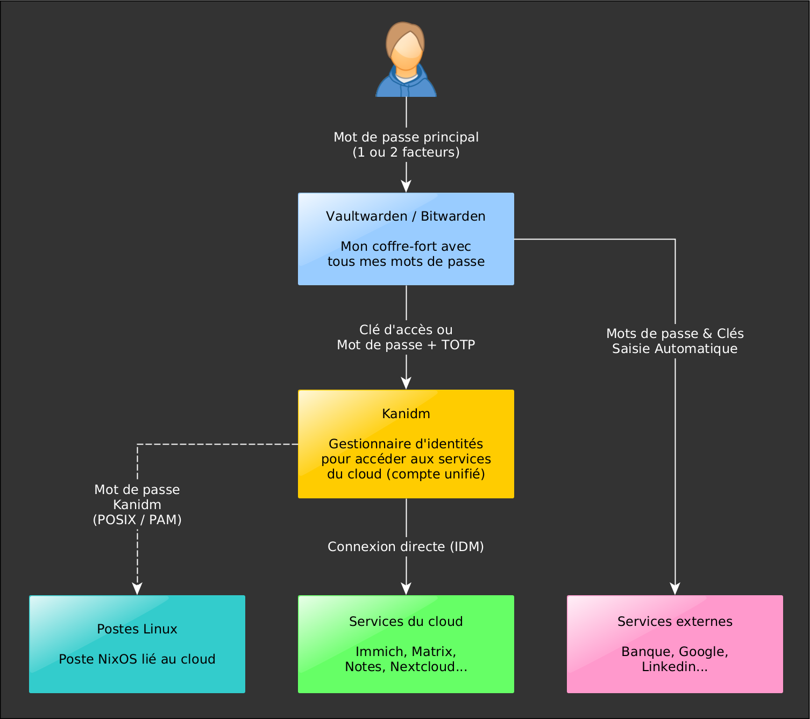

- [Intro : mon cloud souverain et sécurisé](#mon-cloud-souverain-et-sécurisé)
- [Se connecter et gérer mon compte](#se-connecter-et-gérer-mon-compte)
- [Mode d'emploi des services](#services-en-ligne)

## Mon cloud souverain et sécurisé

:::note[A lire attentivement]
Cette introduction est très utile pour comprendre l'intérêt et le fonctionnement du cloud.
:::

- Un **espace numérique** pratique et sécurisé pour mes données.
- Des **services utiles** : messagerie, visio, documents, médias, sauvegardes, jeux…
- Des **systèmes Linux pré-installés** (en option) très faciles à utiliser.

:::tip[Idéal pour les jeunes]
Un espace protégé adapté aux plus jeunes, pour un apprentissage maîtrisé de l'outil informatique et des réseaux&nbsp;!
:::

---

### Les bénéfices

* 🔐 **Sécurité maxi** : nos données restent contrôlées et transitent chiffrées.
* 🚫 **Aucune fuite de données** vers les publicitaires, IA, assurances, impôts...
* 🔁 **Sauvegardes 3-2-1 automatisées**, chiffrées, distribuées, compressées.
* 🕐 **Applications au top**, stables, utiles et simples, pour gagner du temps.
* 🔑 **Un seul mot de passe** à retenir (SSO + coffre-fort).
* 👶 **Convivial** pour petits et grands.

:::note[Mon patrimoine numérique]
Photos, vidéos, récits, contacts, dialogues, mots de passe... de plus en plus de souvenirs et données liées à mon patrimoine sont désormais numériques. 
Utiliser un lieu sûr, souverain et maîtrisé pour ces données, qui font mon identité, est primordial. C'est la raison d'être de ce cloud.
:::

:::tip[Dois-je quitter les GAFAM ?]
Non. Ces entreprises offrent des services utiles. Des milliers d'ingénieurs y travaillent, rendant la simplicité et l'efficacité de leurs outils difficilement rivalisable.
Elles donnent aussi beaucoup au monde de l'open-source et sont parfois de précieux partenaires.
Cependant leur caractère privé ne leur permet pas de garantir un espace de liberté total et sûr pour toutes mes données et conversations personnelles.
Celles-ci peuvent être analysées et potentiellement transmises à des publicitaires, assurances, moteurs d'IA, services gouvernementaux.
Techniquement, mes données peuvent aussi être confisquées, détournées et conservées contre mon gré, même si un professionnel sérieux ne ferait pas cela.
A moi, donc, de faire la part des choses.
:::

### Les services

Ces applications [open-source](https://fr.wikipedia.org/wiki/Open_source) fiables sont minutieusement sélectionnés pour leur utilité, maturité et facilité d’utilisation.

:::tip[Accès unique (SSO)]
Une seule connexion suffit pour chacun d’eux (pas besoin de rentrer 36 mots de passe).
:::

| **Service** | **Appli** | **Utilité** |
|----|----|----|
| 🔐 [Coffre-fort](#-vaultwarden) | Vaultwarden | Mes mots de passe, clés et données critiques. |
| 🖼️ [Photos & vidéos](#%EF%B8%8F-immich-photos) | Immich | Gestionnaire complet de photos et vidéos avec IA. |
| ☁️ [Données](#%EF%B8%8F-nextcloud-fichiers--données) | Nextcloud | Un endroit sécurisé pour mes données. |
| 💬 [Messages & visio](#-matrix-messages--visio) | Matrix | Alternative à « WhatsApp » (messagerie et visio). |
| 🎬&nbsp;[Films&nbsp;&&nbsp;Musiques](#-jellyfin-films--musiques) | jellyfin | Une super médiathèque à la « Netflix ». |
| 📝 [Notes](#-outline-notes) | Outline | Prises de notes individuelles et collectives. |
| 🍽️ [Cuisine](#%EF%B8%8F-mealie-recettes-de-cuisine) | Mealie | Application de recettes de cuisine. |
| 🔎 [Recherche](#-searxng-recherche) | Searxng | Recherche globale, sécurisée, sans publicité. |

Services techniques :

| **Service** | **Appli** | **Utilité** |
|----|----|----|
| 👨 [Identité](#-kanidm-idm) | Kanidm | Mon identité (mot de passe unique - SSO). |
| 🛑 [Anti-pub](#-adguardhome-firewall-anti-pub) | AdguardHome | Pare-feu et filtre anti-malware qui accélère Internet. |
| 🧑‍💻&nbsp;[Forge&nbsp;GIT](#-forgejo-forge-git) | Forgejo | Dépôt et gestionnaire [GIT](https://git-scm.com/) pour informaticiens. |

### Les postes Linux (NixOS)

Le système Linux du cloud s’installe sur n’importe quel ordinateur PC relié au réseau. 

:::caution[Linux, c'est compliqué ?]
Contrairement à ce qu'on croit, **Linux et ses applications sont devenus très simples d'utilisation.**
Et notre système pré-installé est encore plus facile à prendre en main&nbsp;!
:::

:::tip[Un gain de temps à tous les niveaux]
* 100% pré-installé -> programmes, comptes utilisateur et configurations, tout y est.
* 100% info-gérés → pas besoin d’administrer le système, tout est automatique.
* Idéal et performant avec les vieux PC qu’on utilise plus.
:::

:::note[Pourquoi Linux / NixOS ?]
- **Linux** est un système libre, donc sûr, en raccord avec l'idée d'un espace numérique souverain et sécurisé. La transparence du code de Linux garantit l'absence de "backdoors" et programmes potentiellement indésirables.
- **NixOS** est un système Linux innovant qui permet la reproductibilité, des configurations minutieuses et une très grande stabilité. 
:::

### Les profils d'utilisateurs

Chaque utilisateur est lié à un “profil” (au choix et interchangeable), qui détermine : 

* Les programmes et configurations [des postes](#les-postes-linux-nixos) (éducation, bureautique, jeux…).
* L'accès et la configuration des [services en ligne](#les-services).

| **Profil** | **Description** |
|----|----|
| ⚪ minimal | Le strict minimum de programmes et outils. |
| 🔵 normal | Pour utilisateur bureautique non-informaticien -> l'essentiel. |
| 🟣 avancé | Pour informaticien -> un joli shell et des outils de développement. |
| 🔴 admin | Compte dédié aux administrateurs réseaux et systèmes (expert). |
| 🎨 créateur | Pour créateur multimédia -> vidéo, musique, photo, image. |
| 📘 étudiant | Pour les études -> prendre des notes, s'organiser, étudier. |
| 🎮 Joueur | Plein de jeux natifs sous Linux. |
| 🎒 ado | Des applis éducatives et funs pour commencer avec internet. |
| 🧩 enfant | Logiciels éducatifs pour apprendre, sans accès internet. |
| 🧸 baby | Système très épuré -> apprendre la souris, les nombres, formes, etc. |

### Les nœuds

:::note[Un nœud ?]
Un réseau est composé d'ordinateurs appelés "nœuds". Ils ont chacun leur utilité.
Ces informations ne sont pas nécessaires pour utiliser le cloud mais aident à comprendre son fonctionnement.
:::

#### Les nœuds NixOS

Ils sont 100% info-gérés (installés et mis à jour automatiquement) :

| **Type** | **Utilité** |
|----|----|
| ❄️ [Ordi au top sous Linux](#les-postes-linux-nixos) | Poste de travail complet, configuré, sécurisé, partagé. → J'ai juste à me connecter et à travailler, jouer, me divertir. |
| 🗄️ Serveur | Un ordinateur qui reste allumé pour y héberger des services : → Jellyfin, Immich, Nextcloud, sauvegarde, partages, etc. |
| 🌐 Passerelle | Un petit bijou qui fait le lien entre réseau local et Internet. → Pare-feu, routeur, serveur DNS, client VPN… |
| 🎼&nbsp;Serveur&nbsp;de&nbsp;coordination | Ce sombre individu est le « chef d’orchestre » du réseau. → Quelque part sur internet, toujours prêt à nous servir. |

:::note[En savoir plus]
Sur la composition du réseau dans [sa présentation](/fr/doc/introduction/#le-réseau-dnf).
:::

#### Les nœuds rattachés

Je peux connecter au réseau des périphériques tiers :

- 📱 **Mon smartphone, tablette** Je peux me brancher au réseau et à tous ses services.
- 💻 **Mon ordi / système adoré** Sous Windows, macOS ou Linux, j'accède aussi aux services.

## Se connecter et gérer mon compte

J’ai besoin :

* **D’un mot de passe principal** pour mon coffre-fort (vaultwarden).
* **D’une identité unique** pour tous les services du cloud (kanidm / IDM).

Mon administrateur doit effectuer une procédure pour que je puisse définir ces accès.

* **Mot de passe principal** : un e-mail contenant un lien pour saisir le mot de passe.
* **Identité** : un QR-Code ou un lien pour définir une clé et un mot de passe "2FA".

:::tip[A savoir !]
- 🔒 **Mon mot de passe principal** (Vaultwarden / Bitwarden) permet de me connecter à mon coffre-fort.
- 🔑 **Ma clé d’authentification** (Clé IDM) permet de me connecter à toutes les applications du cloud.
- 🔐 **Mon mot de passe “2 facteurs”** (Clé 2FA) permet de me connecter aussi, si j'ai un problème avec ma clé.
:::

Le **mot de passe principal** est primordial, c'est la seule chose qu'il faut **absolument retenir**.

Mon identification suit le schéma suivant :

:::note[Qu'est-ce qu'une clé ?]
Une clé numérique permet de s’identifier sans avoir à utiliser de mot de passe.
Elle est située dans mon coffre fort. 
Quand une application en a besoin, Bitwarden s’ouvre automatiquement. 
C’est le moyen **LE PLUS SIMPLE ET SÉCURISÉ** pour m’authentifier.
:::

:::note[Un mot de passe “2 facteurs” ?]
Une authentification 2 facteurs (2FA) utilise :
- un mot de passe (quelque chose que je connais)
- ET un autre “facteur” (quelque chose que je possède)

Ce dernier peut être un code envoyé par mail / sms, un générateur de code à 6 chiffres, etc.
De nos jours, énormément de mots de passe sont compromis, c’est pourquoi ce type d’authentification devient nécessaire.
:::

:::caution[Sécuriser mon coffre-fort]
Pour faciliter l’accès au coffre (vaultwarden / bitwarden), un mot de passe principal “simple” est autorisé par défaut.
Mais il est vivement recommandé de lui adjoindre un 2ème facteur pour sécuriser l’accès, surtout je met tous mes mots de passe dedans (banque, comptes sociaux, etc.).
:::

## Services en ligne

Tous les services du cloud sont open-source et ont leur propre documentation en ligne. Mais voici quelques petites introductions utiles.

### 🔐 Vaultwarden

Vaultwarden est mon coffre-fort. Il contient mes mots de passe, clés numériques, cartes de crédit et informations confidentielles. 
Ces informations sont stockées chiffrées et sauvegardées automatiquement. Par défaut, je suis le seul a y avoir accès.

:::tip[Fonctionnalités utiles]
- Partager des accès avec d'autres personnes grâce aux "collections".
- Ranger mes mots de passe et clés dans des dossiers.
- Envoyer des informations confidentielles grâce aux "sends".
:::

:::note[Bitwarden : l'application cliente]
Bitwarden peut s'installer comme **plugin dans un navigateur** ou comme **application mobile**.
Il simplifie ma vie grâce à la saisie automatique de mes identifiants et mots de passe et plein d'autres fonctionnalités. 
Bitwarden permet de faire tout ce que peut faire Vaultwarden (le serveur, qui détient les données).
:::

:::caution[Important : configuration de Bitwarden]
Par défaut, Bitwarden est réglé sur "bitwarden.com".
Il faut sélectionner "self-hosted" puis entrer l'URL de Vaultwarden pour pouvoir utiliser Bitwarden avec le cloud.

⚠️ JE NE DOIS PAS SAISIR MON MOT DE PASSE PRINCIPAL AVANT D'AVOIR FAIT CELA.
:::

### 👨 Kanidm (idm)

Mon gestionnaire d'identité, qui permet de m'identifier facilement aux services du cloud.

### 🖼️ Immich (photos)

Mon gestionnaire de photos et vidéos personnelles, avec des fonctions de recherche et reconnaissance faciale IA souveraines et efficaces.

Pour synchroniser les photos de mon smartphone dans Immich : 

* Installer l'application immich sur le smartphone.
* Paramétrer la synchronisation en donnant l'url de Immich.

### ☁️ Nextcloud (fichiers & données)

Un espace pour mes fichiers, contacts, calendriers et nombreuses autres données personnelles, que je peux synchroniser et partager.

### 💬 Matrix (messages & visio)

Mon réseau-social. Toutes mes conversations sont chiffrées et restent chez moi. Je peux le lier à la fédérations (autres réseaux matrix) ou non. 
Je peux aussi synchroniser mes comptes WhatsApp, Messenger, Telegram, Signal, Discord...

* Installer "Element" sur PC et Element Classic sous android / ios :
  * Accéder au réseau matrix.domaine.tld (ne pas aller sur matrix.org !)
  * Se connecter avec "IDM" (ne pas créer de compte !)
  * Le compte matrix se crée au premier accès
  * Inviter l'utilisateur sur les salons
* Pour qu'on puisse appeler (comme avec whatsapp), il faut activer et autoriser les notifications.

:::caution[Sélectionner le bon serveur matrix !]
Cliquer sur "Self-Hosted" puis entrer le domaine matrix du cloud.
:::

### 🎬 Jellyfin (films & musiques)

Ma médiathèque personnelle pour mes films, ma musique, que je peux utiliser avec mon téléviseur.

### 📝 Outline (notes)

Un espace pratique pour prendre des notes personnelles ou partagées, écrire des documentations, faire des check-lists.

### 🍽️ Mealie (recettes de cuisine)

Une appli très pratique pour importer, saisir, paufiner mes recettes de cuisine.

### 🔎 Searxng (recherche)

Un multi-moteur de recherche qui croise les informations de nombreux autres moteurs et permet des recherches sécurisées.

### 🛑 AdguardHome (firewall anti-pub)

AdguardHome est hébergé sur les passerelles et retire les publicités et traceurs, tout isolant la zone avec un firewall. Grâce à lui, je navigue plus vite et mieux sur internet.

### 🧑‍💻 Forgejo (forge git)

Forgejo est une forge git, un GitHub personnel et souverain. Il permet d'héberger des projets, gérer des issues, des pool request et bien plus encore.
GIT est aussi un excellent moyen d'organiser, versionner et sauvegarder ses documents.